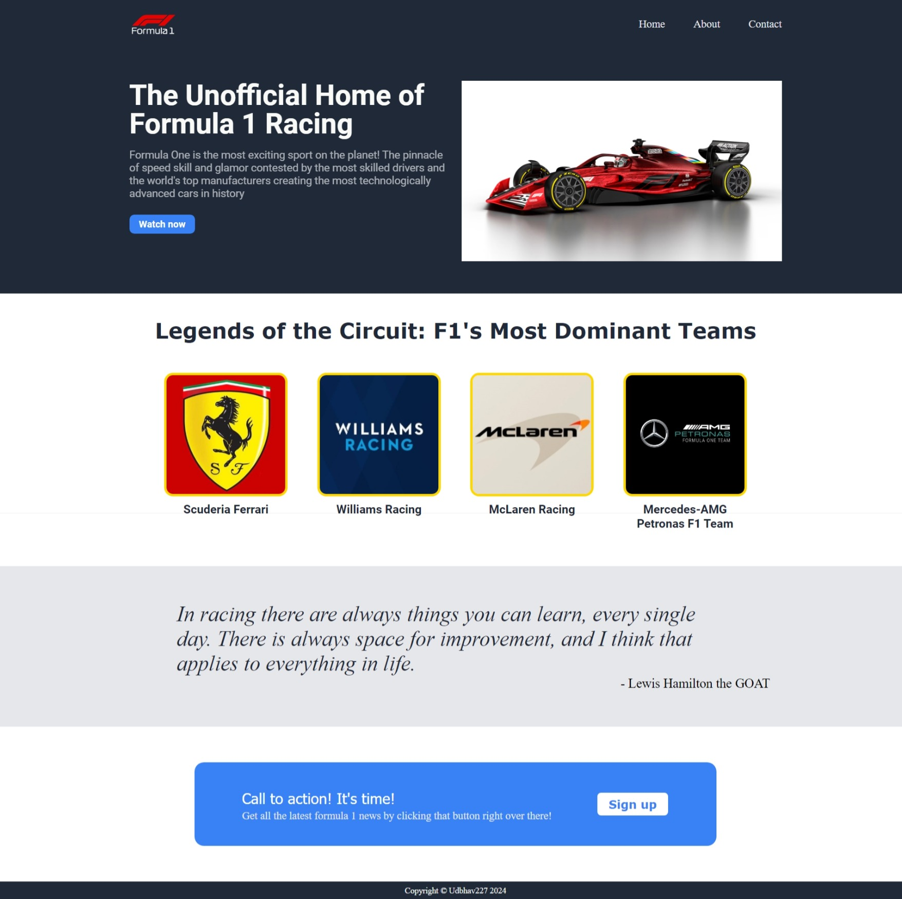

# F1 Landing Page 🏎️

Welcome to the F1 Landing Page project! This project was created to practice and demonstrate the use of HTML and CSS, specifically focusing on Flexbox.

## Website 💻

You can view the live website here: [udbhav227.github.io/f1-landing-page](https://udbhav227.github.io/f1-landing-page)

## Project Description 📄

This is a simple landing page for a Formula 1-themed website. The project is designed to showcase the following:

- Use of HTML for structuring the content.
- Use of CSS for styling and layout.
- Implementation of Flexbox for layout management.

## Features 🪶

- **Responsive Design**: Tried my best to make it responsive.
- **Flexbox Layout**: Utilizes CSS Flexbox for arranging elements on the page.
- **Clean and Simple Design**: Focuses on a clean and minimalistic design.

## Screenshots 📸

## Technologies Used 👨🏼‍💻

- HTML5
- CSS3 (Flexbox)